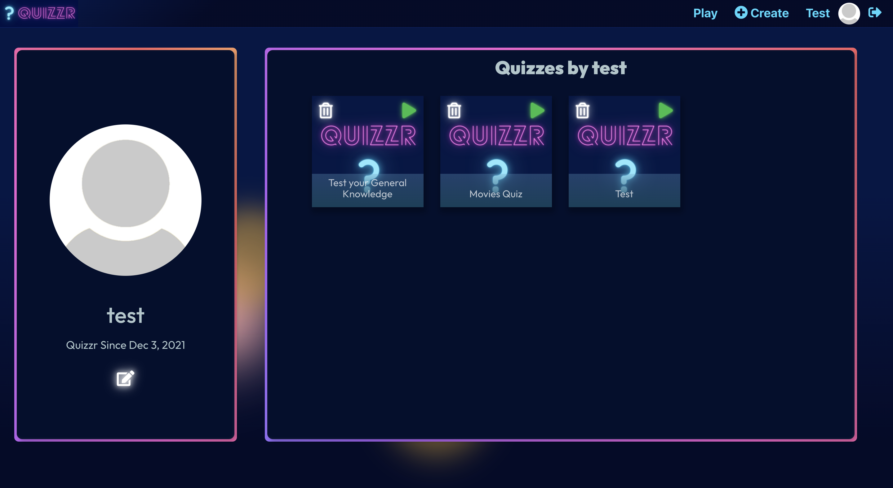

# Live Website

Coming Soon

# Capstone: Quizzr

### Made by: Kathy Wu 

> # Quizzr

> General Assembly Software Engineering Immersive's Coding Bootcamp Capstone Project. Quizzr is an online quiz game application, that allows users to create and play quizzes.
> The project uses MERN stack (MongoDB, Express, React, and Node) along with Sass.

## Table of Contents

- [Technologies Used](#technologies-used)
- [Features](#features)
- [Screenshots](#screenshots)
- [Planning](#planning)
- [User Stories](#user-stories)
- [Project Status](#project-status)
- [Future Improvements](#future-improvements)
- [Acknowledgements](#acknowledgements)

## Technologies Used

- MongoDB / Mongoose
- Express
- REACT
- Node
- SASS

## Features

Current ready features:

- User account creation
- User authentication and authorization
- User profile picture updating
- Creating quizzes
- Deleting quizzes
- Playing quiz games singleplayer

## Screenshots

## Planning

## User Stories

## Project Status

MVP: First iteration of project is complete
Using Sockets.io: Second iteration of project is in progress

## Future Improvements

Plans for future improvement:

- Make multiplayer lobbies
- Multiplayer quiz game
- Friends feature
- History and leaderboards
- Mobile Responsive

## Acknowledgements

- Excellent support team from our instructor Dalton
- All the frontline staff who encourage us in General Assembly!
- Big thank you to Jake for helping me debug!
